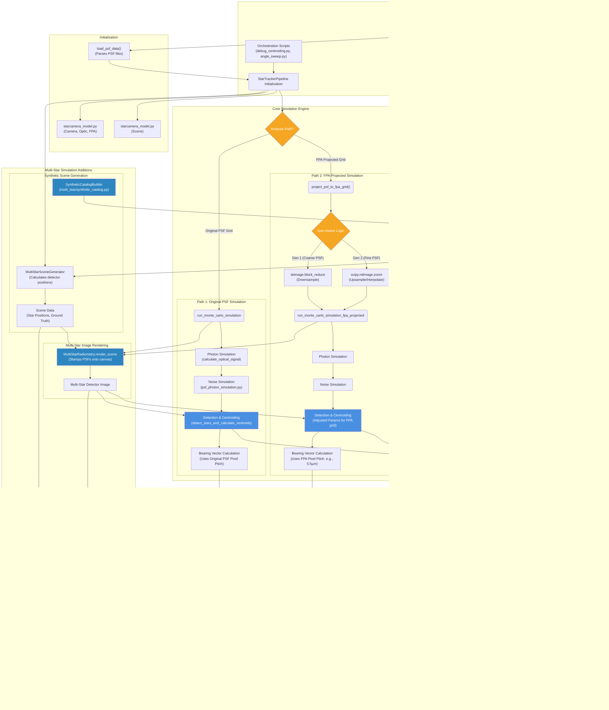

```mermaid
graph TD
    subgraph "Input & Configuration"
        UserInput["Orchestration Scripts<br/>(debug_centroiding.py, angle_sweep.py)"]
        PSF_Dir["PSF Data Directory<br/>(Gen 1, Gen 2, Gen 3)"]
        BAST_Catalog["BAST/catalog.py<br/>(Star Catalogs)"]
        
        UserInput --> PipelineInit
    end

    subgraph "Initialization"
        PipelineInit("StarTrackerPipeline Initialization")
        CameraModel["starcamera_model.py<br/>(Camera, Optic, FPA)"]
        SceneModel["starcamera_model.py<br/>(Scene)"]
        PSFLoad["load_psf_data()<br/>(Parses PSF files)"]

        PipelineInit --> CameraModel
        PipelineInit --> SceneModel
        PSF_Dir --> PSFLoad
        PSFLoad --> PipelineInit
    end
    
    subgraph "Core Simulation Engine"
        PipelineInit --> SimSelector{"Analysis Path?"}

        SimSelector -- "Original PSF Grid" --> SimPathOrig
        SimSelector -- "FPA Projected Grid" --> FPA_Projection

        subgraph "Path 1: Original PSF Simulation"
            direction TB
            SimPathOrig("run_monte_carlo_simulation") --> PhotonSimOrig["Photon Simulation<br/>(calculate_optical_signal)"]
            PhotonSimOrig --> NoiseSimOrig["Noise Simulation<br/>(psf_photon_simulation.py)"]
            NoiseSimOrig --> DetectOrig["Detection & Centroiding<br/>(detect_stars_and_calculate_centroids)"]
            DetectOrig --> BearingCalcOrig["Bearing Vector Calculation<br/>(Uses Original PSF Pixel Pitch)"]
        end

        subgraph "Path 2: FPA-Projected Simulation"
            direction TB
            FPA_Projection("project_psf_to_fpa_grid()") --> GenAware{"Gen-Aware Logic"}
            GenAware -- "Gen 1 (Coarse PSF)" --> BlockReduce["skimage.block_reduce<br/>(Downsample)"]
            GenAware -- "Gen 2 (Fine PSF)" --> Interpolate["scipy.ndimage.zoom<br/>(Upsample/Interpolate)"]
            
            BlockReduce --> SimPathFPA
            Interpolate --> SimPathFPA
            
            SimPathFPA("run_monte_carlo_simulation_fpa_projected") --> PhotonSimFPA["Photon Simulation"]
            PhotonSimFPA --> NoiseSimFPA["Noise Simulation"]
            NoiseSimFPA --> DetectFPA["Detection & Centroiding<br/>(Adjusted Params for FPA grid)"]
            DetectFPA --> BearingCalcFPA["Bearing Vector Calculation<br/>(Uses FPA Pixel Pitch, e.g., 5.5µm)"]
        end
    end

    subgraph "Detection Details (BAST Integration)"
        style DetectOrig fill:#4A90E2,color:#fff
        style DetectFPA fill:#4A90E2,color:#fff

        DetectOrig --> AdaptiveThresh["Adaptive Local Threshold"]
        DetectFPA --> AdaptiveThresh
        AdaptiveThresh --> ConnectedComp["cv2.connectedComponentsWithStats<br/>(Pixel Grouping)"]
        ConnectedComp --> RegionSelect["Region Selection<br/>(Filter by size, select brightest)"]
        RegionSelect --> CentroidCalc["identify.calculate_centroid<br/>(Intensity-weighted moment)"]
    end

    subgraph "Analysis & Output"
        BearingCalcOrig --> Aggregation["Results Aggregation<br/>(Mean/Std Error)"]
        BearingCalcFPA --> Aggregation
        
        Aggregation --> Visualization["Visualization<br/>(matplotlib plots)"]
        Aggregation --> Export["Data Export<br/>(pandas to .csv)"]
    end
    
    subgraph "Full BAST Attitude Pipeline (Context)"
        CentroidCalc --> BAST_Match["BAST/match.py<br/>(Pattern Matching)"]
        SyntheticCatalog --> BAST_Match
        BAST_Catalog --> BAST_Match
        BAST_Match --> BAST_Resolve["BAST/resolve.py<br/>(Attitude Solution - QUEST)"]
        BAST_Resolve --> FinalAttitude["Final Attitude<br/>(Quaternion)"]
    end

    subgraph "Multi-Star Simulation Additions"
        direction LR
        subgraph "Synthetic Scene Generation"
            direction TB
            SynthCatBuilder["SyntheticCatalogBuilder<br/>(multi_star/synthetic_catalog.py)"] --> SyntheticCatalog["Synthetic Catalog<br/>(3 or 4 stars w/ Ground Truth)"]
            SyntheticCatalog --> SceneGen["MultiStarSceneGenerator<br/>(Calculates detector positions)"]
            PipelineInit --> SceneGen
            SceneGen --> SceneData["Scene Data<br/>(Star Positions, Ground Truth)"]
        end

        subgraph "Multi-Star Image Rendering"
            direction TB
            SceneData --> Radiometry["MultiStarRadiometry.render_scene<br/>(Stamps PSFs onto canvas)"]
            SimPathOrig --> Radiometry
            SimPathFPA --> Radiometry
            Radiometry --> MultiStarImage["Multi-Star Detector Image"]
        end

        subgraph "Alternative Detection Method"
            direction TB
            MultiStarImage --> PeakDetect["detect_stars_peak_method<br/>(Finds local maxima)"]
            PeakDetect --> RefineCentroid["refine_centroid_moment<br/>(Calculates moments in window)"]
            RefineCentroid --> CentroidCalc
        end

        MultiStarImage --> DetectOrig
        MultiStarImage --> DetectFPA
        
        subgraph "Validation"
            direction TB
            BAST_Match --> ValidationStep["Validation<br/>(validate_matches)"]
            SceneData --> ValidationStep
            ValidationStep --> ValidationResults["Validation Results<br/>(Match Correctness)"]
        end
    end

    style SimSelector fill:#F5A623,color:#fff
    style GenAware fill:#F5A623,color:#fff
    style SynthCatBuilder fill:#2E86C1,color:#fff
    style Radiometry fill:#2E86C1,color:#fff
    style PeakDetect fill:#4A90E2,color:#fff
    style ValidationStep fill:#1ABC9C,color:#fff
```